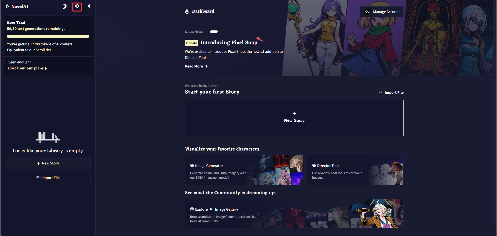
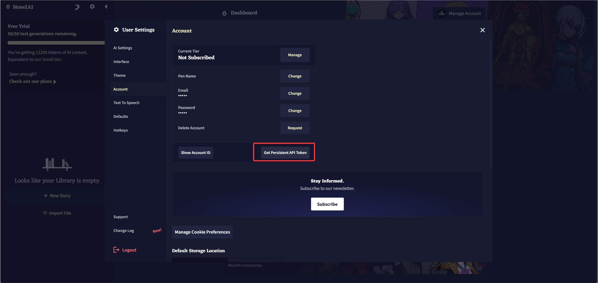
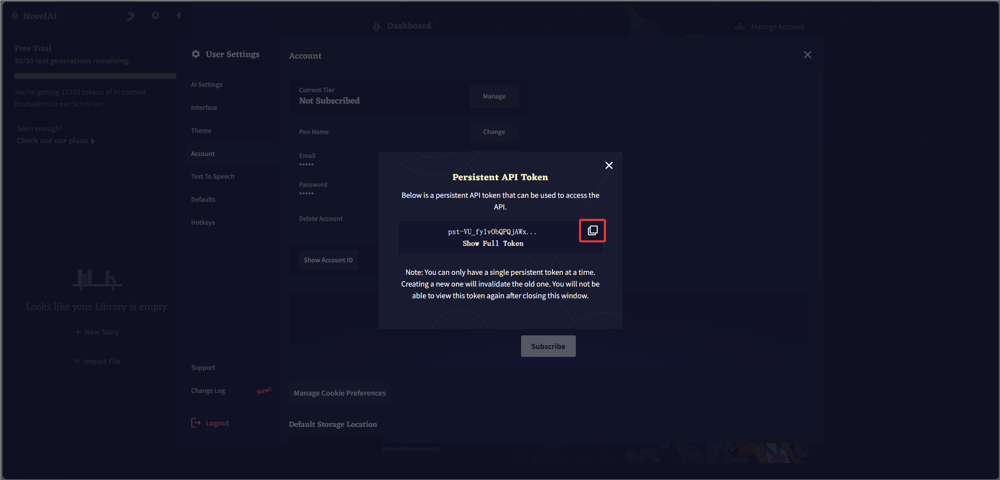

# ComfyUI_NAIDGenerator-neo

面向 ComfyUI 的 NovelAI 图像生成节点。项目使用独立的节点命名空间和模块化实现，支持文本生成、图生图、局部重绘、V3/V4 Vibe Transfer 以及 Director Tools。

## 安装

在 ComfyUI 的 `custom_nodes` 目录执行：

```bash
git clone https://github.com/chen079/ComfyUI_NAIDGenerator-neo.git
```

克隆后目录名称应为 `ComfyUI_NAIDGenerator-neo`。如果你是在仓库改名前安装的，本地旧目录不会随 GitHub 仓库自动改名，需要手动将 `comfyui_naidgenerator` 改为 `ComfyUI_NAIDGenerator-neo`。

安装依赖并重启 ComfyUI：

```bash
python -m pip install -r ComfyUI_NAIDGenerator-neo/requirements.txt
```

节点位于 `NAI Neo` 分类。

界面提供英文和简体中文翻译，跟随 ComfyUI 的语言设置自动切换。节点 ID、端口类型和下拉选项值不会随界面语言改变，因此切换语言不会影响工作流。

## 获取 NovelAI API Token

NovelAI 在界面中将这里使用的密钥称为 **Persistent API Token**。它不是账号密码，也不是 Account ID。

1. 打开 [NovelAI Stories](https://novelai.net/stories) 并登录，在页面左上角点击齿轮按钮，打开 **User Settings**。

   

2. 在左侧选择 **Account**，然后点击 **Get Persistent API Token**。

   

3. 在弹窗中点击 **Show Full Token** 显示完整令牌，再点击右侧复制按钮。令牌通常以 `pst-` 开头。

   

4. 立即妥善保存令牌。NovelAI 同一时间只允许一个 Persistent API Token；创建新令牌会使旧令牌失效。关闭弹窗后不能再次查看当前令牌，只能重新生成。

不要把完整令牌发给其他人，也不要放进截图、工作流 JSON、Issue 或聊天记录。怀疑泄露时，应在 NovelAI 中重新生成令牌，并更新本插件的 `.env`。

## 配置 Token

在本插件目录的 `.env` 文件中设置 NovelAI Persistent API Token。可以复制 `.env.example` 后填写：

Windows PowerShell：

```powershell
Set-Location ComfyUI/custom_nodes/ComfyUI_NAIDGenerator-neo
Copy-Item .env.example .env
notepad .env
```

Linux / macOS：

```bash
cd ComfyUI/custom_nodes/ComfyUI_NAIDGenerator-neo
cp .env.example .env
```

将 `.env` 内容修改为一行：

```dotenv
NAI_ACCESS_TOKEN=pst-你的完整令牌
```

等号两侧不要添加空格，也不需要引号。保存文件后完整重启 ComfyUI。

例如使用默认目录结构时，配置文件路径为：

```text
ComfyUI/custom_nodes/ComfyUI_NAIDGenerator-neo/.env
```

项目只读取插件目录下的 `.env`，只支持 `NAI_ACCESS_TOKEN`，不会在导入节点时自动安装依赖，也不会通过用户名和密码登录。`.env` 已被 Git 忽略，不会随正常提交上传。

如果启动时提示 `Set NAI_ACCESS_TOKEN`，请依次检查：

- 文件名确实是 `.env`，而不是 Windows 隐藏扩展名后的 `.env.txt`。
- `.env` 位于 `ComfyUI_NAIDGenerator-neo` 目录，与 `nodes.py` 同级。
- 配置键名完整写成 `NAI_ACCESS_TOKEN`。
- 修改 `.env` 后已经完整重启 ComfyUI。
- 如果刚生成过新令牌，`.env` 中没有继续使用已失效的旧令牌。

## 节点

- `NAI Neo · Generate`：生成图片，只返回 ComfyUI `IMAGE`，不会自动保存文件。
- `NAI Neo · ModelOption`：选择 NovelAI 模型。
- `NAI Neo · Img2ImgOption`：配置图生图。
- `NAI Neo · InpaintingOption`：配置局部重绘。
- `NAI Neo · EncodeVibe`：为 V4/V4.5 编码参考图。
- `NAI Neo · VibeTransferOption`：设置 Vibe 强度并组合多个参考。
- `NAI Neo · NetworkOption`：设置生成请求的超时、重试和错误忽略策略。
- `NAI Neo · RemoveBG`、`LineArt`、`Sketch`、`Colorize`、`Emotion`、`Declutter`：NovelAI Director Tools。

## V4 / V4.5 Vibe Transfer

```text
Load Image → NAI Neo · EncodeVibe
NAI Neo · EncodeVibe → NAI Neo · VibeTransferOption.encoded_vibe
NAI Neo · VibeTransferOption → NAI Neo · Generate.option
```

`information_extracted` 在 Encode Vibe 节点设置，修改它或参考图会重新编码。`strength` 在 Vibe Transfer Option 节点设置，修改它可以复用未失效的编码结果。NovelAI 通常对一次新编码收取 2 Anlas；ComfyUI 缓存失效或重启后可能再次编码。

V3 模型可以把原图直接连接到 Vibe Transfer Option 的 `image`。V4/V4.5 必须先经过 Encode Vibe。编码模型与生成模型必须一致。

## 保存图片

Generate 和 Director 节点不会写入 `output`。需要保存时，请连接 ComfyUI 自带的 `SaveImage` 节点；只想查看时可以连接预览节点。

## 迁移说明

本项目使用 `NAINeo...` 节点 ID 及 `NAI_NEO_OPTION`、`NAI_NEO_VIBE` 端口类型。原项目节点不会被注册，旧工作流需要重新添加并连接 NAI Neo 节点。

## 致谢与许可

本项目最初基于 [bedovyy/ComfyUI_NAIDGenerator](https://github.com/bedovyy/ComfyUI_NAIDGenerator) 开展，感谢原作者和贡献者提供的基础工作。

此后项目采用独立的节点标识、代码结构、请求模块、图片转换模块、提示词模块、测试和文档。项目仍按照原项目采用的 GNU GPL v3 发布；完整条款见 [LICENSE](LICENSE)。NovelAI、ComfyUI 及相关名称和商标归各自权利人所有，本项目不是 NovelAI 或 ComfyUI 官方项目。
